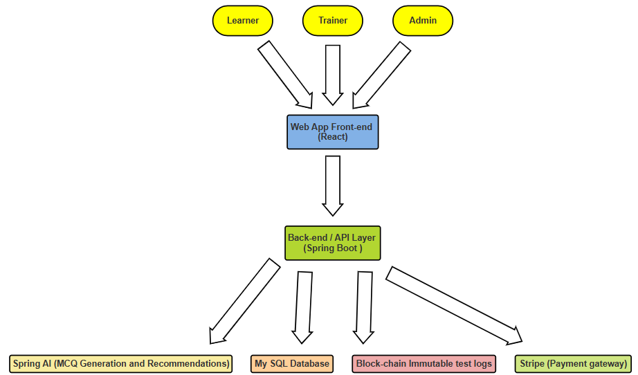
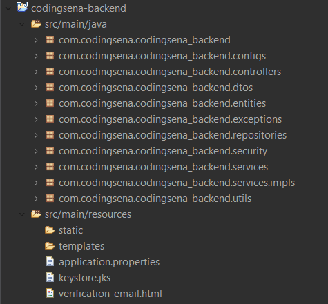

# 🔥 Coding Sena — Backend  


### AI-Driven Learning & Assessment Platform with Secure Blockchain-Backed Test Logs

A production-grade backend powering **Coding Sena**, an advanced e-learning platform featuring AI-generated MCQs, secure blockchain-backed test logs, Stripe payments, AWS S3 content storage, and multi-role access control.

---

# 📸 High-Level Architecture Diagram



---

# 🚀 Tech Stack

### Core
- Spring Boot 3.5.4  
- Java 17  
- Spring Security + OAuth2 Resource Server 
- Spring Data JPA  
- PostgreSQL (Render Production)  
- MySQL (Local Development)

### AI & ML
- Spring AI (OpenAI Chat Completions API)
- AI-generated MCQs
- AI-driven performance-based recommendations

### Blockchain
- Web3j  
- Ethereum + Alchemy

### Storage
- AWS S3

### Payments
- Stripe

### Email
- Resend API

### Utilities
- ModelMapper  
- Dotenv  
- Lombok  

---

# 🎯 Key Features

### 👑 ADMIN
- Full platform access  
- Manage batch & trainers  
- All Trainer permissions included

### 🧑‍🏫 TRAINER
- Manage assigned batches (Topics, Study Materials, Tests, etc.)
- Create/update AI-generated MCQ tests  
- Set test rules  
- Export test reports as Excel  

### 🧑‍🎓 LEARNER
- Buy & enroll in batches  
- Access structured content  
- Attempt timed MCQs  
- Receive AI recommendations
- Filter & sort batches by ID, name, price, etc. 

### 🛡 Security
- JWT using Java Keystore  
- Role-based access  
- OAuth2 Resource Server  

---

# 🗂 Project Structure



---

# 🛠 Setup Instructions

### Clone
```bash
git clone https://github.com/ritik-raj-25/coding-sena-backend
cd coding-sena-backend
```

### Local Development (MySQL)
```bash
mvn spring-boot:run
```

### Production (Render)
- DB → PostgreSQL  
- Build → Docker  
- Run → Java 17  

---

# 🔐 Environment Variables (`.env.example`)

```
#############################
# JWT Credentials
#############################
JWT_KEYSTORE_LOCATION=
JWT_KEYSTORE_PASSWORD=
JWT_KEY_ALIAS=
JWT_KEY_PASSWORD=

#############################
# AWS Credentials
#############################
AWS_ACCESS_KEY_ID=
AWS_SECRET_ACCESS_KEY=
AWS_REGION=
AWS_BUCKET_NAME=
AWS_PROFILE_PIC_SUB_BUCKET_NAME=
AWS_BATCH_COVER_PIC_SUB_BUCKET_NAME=
AWS_BATCH_CURRICULUM_SUB_BUCKET_NAME=

#############################
# Email / Resend
#############################
RESEND_API_KEY=
SPRING_MAIL_FROM=

#############################
# MySQL (Local Dev)
#############################
SPRING_DATASOURCE_URL=
SPRING_DATASOURCE_USERNAME=
SPRING_DATASOURCE_PASSWORD=
SPRING_JPA_PROPERTIES_HIBERNATE_DIALECT=
SPRING_JPA_HIBERNATE_DDL_AUTO=

#############################
# PostgreSQL (Render Prod)
#############################
DATABASE_URL=
DATABASE_USERNAME=
DATABASE_PASSWORD=

#############################
# Stripe Credentials
#############################
STRIPE_SECRET_KEY=
STRIPE_PUBLISHABLE_KEY=
STRIPE_WEBHOOK_SECRET=

#############################
# Spring AI Credentials
#############################
OPENAI_API_KEY=
OPENAI_BASE_URL=
OPENAI_CHAT_MODEL=

#############################
# Blockchain Credentials
#############################
ALCHEMY_URL=
PRIVATE_KEY=
CONTRACT_ADDRESS=

#############################
# App URLs
#############################
BASE_URL=
FRONTEND_BASE_URL=
```

---

# 📦 Deployment

### Render
- Environment: Docker
- DB: PostgreSQL  

---

# 📡 API Overview
- User Authentication APIs
- Batch Management APIs
- Enrollment & Stripe APIs
- Topic APIs
- Study Material APIs
- MCQ (AI) APIs
- Test APIs
- Test Attempt APIs
- Skills APIs
- Webhook API

---

# 📝 License

MIT License